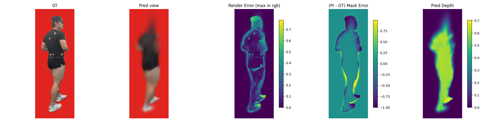

# Markerless Motion Capture: 3DGS-based Pitching Biomechanics

7-camera 240Hz video of baseball pitching &rarr; SMPL body fitting &rarr; GART (3D Gaussian Splatting) &rarr; biomechanical analysis.

## Pipeline

```
iPhone 7-cam 240Hz video
        |
   SAM3 masking (pitcher isolation)
        |
   OpenPose 2D keypoints + 4-stage smoothing
        |
   U-HMR multi-view (4-cam) body pose estimation
        |
   4-cam sequential 2D reprojection fitting (Rh, Th, body_pose)
        |
   GART 3D Gaussian Splatting (4-view, 1000 frames)
        |
   Biomechanical analysis (planned)
```

## Results

| Stage | Metric | Value |
|-------|--------|-------|
| OpenPose smoothing | Jitter reduction | 83-87% |
| U-HMR inference | Frames / Time | 999 frames / 18 min (A100) |
| 4-cam reproj fitting | Mean error | 153.5 px |
| 4-cam reproj fitting | Frames < 200px | 956/1000 (96%) |
| GART 6-view training | Steps / Time | 3000 / 3 min |

### GART Rendering (6-view, 100 frames, Step 2999)



## Documents (LaTeX / XeLaTeX)

### Textbooks
| File | Topic |
|------|-------|
| `main.tex` | Part 1: NeRF &rarr; 3DGS &rarr; SMPL &rarr; GART |
| `part2_motion_analysis.tex` | Part 2: Markerless motion capture + gait analysis |
| `part3_pitching.tex` | Part 3: 7-view baseball pitching analysis |
| `part0_camera_math.tex` | Camera math guide |
| `part0_colmap_theory.tex` | COLMAP theory |

### Experiment Logs
| File | Topic |
|------|-------|
| `experiment_log_20260412.tex` | Day 1: VGGT calibration &rarr; SMPL fitting attempts |
| `experiment_log_20260413.tex` | Day 2: SMPLest-X &rarr; U-HMR multi-view success |
| `experiment_log_20260413_final.tex` | Day 2 final: Conda envs, U-HMR 999 frames, GART first run |
| `experiment_log_20260414.tex` | Day 3: GART install, 4-view pipeline, 1000-frame reproj |

### Guides & Reports
| File | Topic |
|------|-------|
| `fitting_guide.tex` | SMPL fitting guide & troubleshooting |
| `part4_openpose_smpl_fitting.tex` | OpenPose &rarr; SMPL fitting guide |
| `part5_dev_setup.tex` | Development environment A-to-Z |
| `part5_research_proposal.tex` | Research proposal |
| `methodology_survey.tex` | SMPL-free methods survey |

## Code

### Server Scripts (`data/`)
| Script | Description |
|--------|-------------|
| `uhmr_all_frames.py` | U-HMR 999-frame 4-view inference |
| `uhmr_7cam_reproj.py` | 7-cam 2D reprojection SMPL fitting |
| `batch_refine.py` | Batch SMPL fitting with SMPLest-X init |
| `vggt_calibrate.py` | VGGT camera calibration |
| `smplestx_sam_bbox.py` | SMPLest-X with SAM bbox |

### Pipeline (`pitching_pipeline/`)
Modular Python pipeline with YAML config for the full workflow.

## Project Structure

```
.
├── main.tex, part*.tex, ...     # LaTeX textbooks (22 docs)
├── preamble/                     # Shared LaTeX preamble
├── data/
│   ├── gart_4v_results/          # 4-view reproj results
│   ├── gart_7v_results/          # 6-view GART rendering results
│   ├── gart_results/             # 1-view GART results (baseline)
│   └── *.py                      # Server-side scripts
├── colmap/
│   ├── compare_result/           # Camera calibration
│   └── visualizations/           # 3D viewers (HTML)
├── pitching_pipeline/            # Python pipeline code
└── Makefile                      # LaTeX build
```

## Build

```bash
# All PDFs (requires XeLaTeX + kotex)
make all

# Single document
xelatex experiment_log_20260414.tex
```

## Server

- GPU: NVIDIA A100 80GB
- Conda envs: `uhmr` (PyTorch 2.3.1+cu121), `gart` (PyTorch 2.0.0+cu118)
- GART: [JiahuiLei/GART](https://github.com/JiahuiLei/GART)
- U-HMR: [XiaobenLi00/U-HMR](https://github.com/XiaobenLi00/U-HMR)

## Status

- [x] Camera calibration (VGGT 7-cam)
- [x] SAM3 pitcher masking (7-cam, 1000 frames)
- [x] OpenPose 2D + 4-stage smoothing
- [x] U-HMR 4-view body pose (999 frames)
- [x] 4-cam sequential reproj fitting (1000 frames, mean 153px)
- [x] GART installation (official install.sh)
- [x] GART 6-view 100-frame training (pitcher shape reconstructed)
- [ ] GART 4-view 1000-frame training
- [ ] Rendering quality improvement (more steps, better reproj)
- [ ] Biomechanical analysis (SMPL2AddBiomechanics &rarr; OpenSim)
